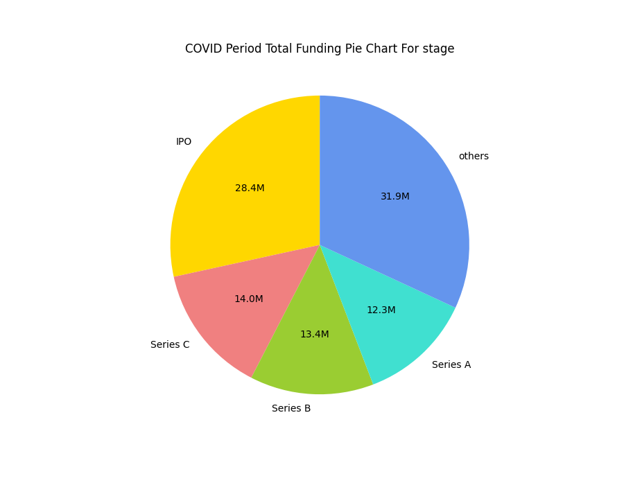

# COVID-19 Funding Behavior Investigation
## User Manual
### Prerequisites
1. Install Python-3.9
2. Run `pip install -r requirements.txt`
3. Chrome must be installed in your computer. (Other browswers are not supported yet.)
4. Download the stable release of selenium chromedriver from this link: [Chromedriver](https://sites.google.com/chromium.org/driver/)
5. Extract the zip file downloaded.
    1. Usually, selenium would be able to detect the chromedriver after it is extracted (even if it is saved in the Download folder).
    2. However, it is does not work, try moving the chromedriver folder into the site-packages folder in your python folder. ('C:\Users\username\AppData\Local\Programs\Python\Python39\Lib\site-packages')
### Running the code
1. To webscrape data from CB-Insights.
    1. Create a folder in the same directory for saving webscraped csv files and change `CSV_SAVE_DIR` to the name of the folder on `line 34`.
    2. Run `py -3.9 main.py` and type `n`, as shown below:
    ```
    Have you scraped the data? ("y" or "n")
    n
    ```
2. To visualize data
    1. Run `py -3.9 main.py`
    2. An interactive terminal session will start. You may answer accordingly to your liking.
    3. The following code block presents a sample usage:
    ```
    Have you scraped the data? ("y", "n")
    y
    Start visualizing? ("y" or "n")
    y
    Would you like to visualize pie graphs or line graphs? ("p" or "l")
    p
    What category would you like to visualize? ("company", "country", "industry", "stage")
    stage
    Would you like to visualize multiple years of pie graph? ("y" or "n")
    n
    ```

## Background 
## Purpose
## Dataset
## Future Works